<!-- Typing SVG -->

  

### [Click here to visit my Website / Blog](https://mikemartinez99.github.io/)

### 🧬 About Me

- Research scientist at the **Dartmouth Genomic Data Science Core**, supporting biomedical researchers across Dartmouth and beyond.  
- Currently developing **RGenEDA**, an R package for reproducible genomic exploratory data analysis.  
- Experienced in **bulk RNA-seq**, **single-cell (RNA/ATAC)**, **metagenomics**, and **Snakemake pipeline development**.  
- Passionate about **reproducible pipelines**, **data visualization**, and **genomics data**.
- On a side-quest to learn **Rust**!

---

#### ⚙️ Tool Development & Pipelines

| Project | Description |
|----------|-------------|
| [**RGenEDA**](https://github.com/mikemartinez99/RGenEDA) | R package for streamlined, unified, and reproducible frameworks for omics exploratory data analysis |
| [**GDSCtools**](https://github.com/Dartmouth-Data-Analytics-Core/GDSCtools) | R package for general genomic data science utilities |
| [**miRNA and IsomiR Pipeline**](https://github.com/Dartmouth-Data-Analytics-Core/GDSC-miRNAseq-analysis-pipeline) | Snakemake workflow for miRNA and isomiR analysis |
| [**Clover-Seq**](https://github.com/Dartmouth-Data-Analytics-Core/GDSC-clover-Seq/tree/main) | Snakemake workflow for tRNA and small RNA NGS analysis |
| [**WES Pipeline**](https://github.com/mikemartinez99/WES_Pipeline) | Snakemake workflow for whole-exome sequencing processing and analysis |
| [**Rust Learning Journey**](https://github.com/mikemartinez99/Rust_Learning) | My side-quest of learning Rust |

---

#### 💻 Tech Stack

**Languages:**  

**Environments, IDEs, and Ecosystems:**  

**Version Control:**  

---

